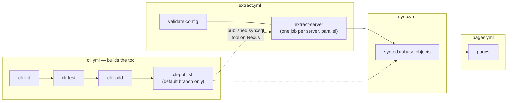

# GitLab CI pipeline

This document is the canonical explanation of the CI pipeline defined by the
root [`.gitlab-ci.yml`](../.gitlab-ci.yml) and the modules under this
directory. The YAML files themselves stay close to bare configuration -
implementation rationale, trade-offs, and cross-job relationships live here
instead, so there's exactly one place to update when the pipeline's design
changes. For product/config docs (what SyncSQL does, `config/servers.json`
schema, the catalog site) see the root [`README.md`](../README.md); for the
`syncsql` CLI's own command reference see
[`cli/docs/cli.md`](../cli/docs/cli.md).

## Modules

`.gitlab-ci.yml` only declares the shared `stages`, shared `variables`, and
an `include:` of four modules under `.gitlab/ci/`:

| Module         | Stages                                              | Jobs |
|----------------|------------------------------------------------------|------|
| `cli.yml`      | `cli-lint`, `cli-test`, `cli-build`, `cli-publish`   | `cli-lint`, `cli-test`, `cli-build`, `cli-publish` |
| `extract.yml`  | `validate`, `extract`                               | `validate-config`, `extract-server` |
| `sync.yml`     | `sync`                                              | `sync-database-objects` |
| `pages.yml`    | `pages`                                             | `pages` |

Splitting this way keeps each concern - building the CLI, extracting from the
fleet, publishing to git, and building/deploying the site - in its own file,
while the root file stays a short table of contents.

### Sharing job config across modules: `extends`, not YAML anchors

`extract.yml` defines two hidden jobs used by other modules:

- `.syncsql_cli` - the common `image`/`before_script` for any job that needs
  the `syncsql` CLI installed from Nexus (used by `validate-config` and
  `extract-server` in `extract.yml`, and by `sync-database-objects` in
  `sync.yml`).
- `.sync_rules` - the common `rules:` restricting a job to
  `schedule`/`web`/`trigger` pipeline sources (used by `extract-server` and
  `sync-database-objects`, and by `pages` in `pages.yml`).

Jobs pull these in with GitLab's `extends:` keyword rather than plain YAML
anchors/aliases (`&foo`/`*foo`, as `cli.yml`'s own `.cli_dotnet` template
uses internally). YAML anchors are resolved per-file at parse time, so they
can't be referenced from a different included file; `extends` is a
GitLab-specific keyword resolved after all `include:`d files are merged into
one configuration, so it works regardless of which module defines the
hidden job and which module(s) consume it. If you add a job that needs
either template, reach for `extends:` (a list, if you need both) rather than
duplicating the config or trying to share a YAML anchor across files.

## Pipeline flow



`cli-publish` doesn't run in the same pipeline as `extract-server`/
`sync-database-objects` most of the time - it publishes a new `syncsql`
version to Nexus whenever `cli/` changes on the default branch, and
`extract-server`/`sync-database-objects` simply install whatever version is
*currently* published there when they next run. The dotted arrows above
mark that indirect, Nexus-mediated dependency, not a same-pipeline `needs:`.

## Trigger rules

- `cli-lint`/`cli-test`/`cli-build`: run on merge requests and pushes, but
  only when `cli/**/*` or `grammar/**/*` changed.
- `cli-publish`: runs only on the default branch, only when `cli/**/*` or
  `grammar/**/*` changed.
- `validate-config`: runs on merge requests and pushes (any change) - it's
  cheap and has no database/git credential requirements, so it's a useful
  fast check even outside `cli/` changes.
- `extract-server`, `sync-database-objects`, `pages`: only run for
  `schedule` or manually-triggered `web`/API pipeline sources (the
  `.sync_rules` hidden job), never on ordinary branch pushes or merge
  requests. Create a schedule under **CI/CD > Schedules** pointing at this
  project to run them regularly.

## Job-by-job

### `cli-lint` / `cli-test` / `cli-build` / `cli-publish` (`cli.yml`)

Lint (`dotnet format --verify-no-changes`), test, and build the `cli/` solution.
`cli-publish` packs `SyncSql.Cli` and pushes it to
the Nexus feed named by `NEXUS_NUGET_SOURCE_URL`, authenticated with
`NEXUS_API_KEY`; `Directory.Build.props`' `<Version>` is the single source of
truth for the published version number - bump it there to cut a new release.

`SyncSql.Lineage.Oracle` analyzes Oracle DDL with a real ANTLR4 PL/SQL parser,
but none of these jobs generate it: the generated C# parser is committed under
`grammar/`, built through a project reference, and included in the CLI tool
package. CI needs neither Java nor an ANTLR tool JAR, and there is no separately
published parser package to coordinate.

None of these jobs touch git, databases, or the fleet - they only build and
publish the CLI tool itself. See [`cli/docs/cli.md`](../cli/docs/cli.md) for
what the tool does once installed.

### `validate-config` (`extract.yml`)

Runs `syncsql validate-config` against `config/servers.json` (or
`config/servers.example.json`, if you haven't created a real config yet) to
check it parses and satisfies the schema. No database or git credentials
needed - this is a fast sanity check for merge requests and pushes.

### `extract-server` (`extract.yml`)

The only jobs that touch your databases. One job **per server**, run in
parallel via a GitLab `parallel: matrix:` over `SERVER_NAME`. Each instance
runs:

```
syncsql sync --config "$CONFIG_PATH" --server-include "^${SERVER_NAME}$" \
  --staging-root "$EXTRACTED_OBJECTS_DIR" --metrics-snapshot-root "$METRICS_SNAPSHOT_DIR"
```

purely locally - no git operation happens here or anywhere in the CLI.
Every instance writes to the *same* `--staging-root`/`--metrics-snapshot-root`;
this is safe because extraction always writes under `<server>/...` first
(see `ExtractedObjectFile.RelativePath`), so concurrent instances scoped to
different servers never collide. GitLab merges every instance's artifacts
together for the downstream `sync-database-objects` job - a plain job name
in `dependencies:` pulls in *all* instances of a `parallel:` job.

The `SERVER_NAME` matrix list must match every server
`config/servers.json`'s `serverSelection` would actually run for this
pipeline, and has to be kept in sync by hand whenever the fleet changes - a
server present in the config but missing from the matrix silently isn't
extracted. **For a small fleet where that upkeep isn't worth the
parallelism**, drop this job and the matrix, and instead give
`sync-database-objects` a first script line of:

```
syncsql sync --config "$CONFIG_PATH" --staging-root "$EXTRACTED_OBJECTS_DIR" \
  --metrics-snapshot-root "$METRICS_SNAPSHOT_DIR"
```

(no `--server-include`, so every server extracts) ahead of its existing git
script - same end result, back to one sequential job doing everything.

### `sync-database-objects` (`sync.yml`)

Publishes the merged output of every `extract-server` instance. This is the
**only** place git actually runs in the whole pipeline: everything
git-shaped - resolving `config.git.*` (via `jq`, since the CLI itself never
reads that block), cloning, replacing `config.git.pathPrefix` with the
merged staged tree, committing, and pushing - is a plain shell script here.
It calls `syncsql metrics update` and `syncsql catalog build` only for the
pure, non-git steps: folding this run's metrics into history, and
rebuilding `catalog.json` (structure, inferred lineage via a real parser per
engine, and history/heatmap/point-in-time mined from this repo's own commit
history). One commit carries the extracted objects, `catalog.json`, and the
updated `metrics/` tree together.

Notable details in that script:

- **`config.git.*` defaults** (branch `main`, path prefix `objects`, etc.)
  match what SyncSQL has always used - see the root README's Configuration
  section. The CLI never resolves or acts on this block itself; this script
  is the one place that does.
- **Push token**: `CI_JOB_Maintainer_Token` (falling back to
  `GIT_PUSH_TOKEN`) is handed to git only through `GIT_ASKPASS` plus a
  process environment variable - never a CLI argument, never embedded in
  the remote URL - so it can't leak via a process listing, `git remote -v`,
  or shell history.
- **Wipe and repopulate**: the target directory (`config.git.pathPrefix`) is
  deleted and rewritten from scratch on every run, so objects dropped from
  the source database (or excluded by an updated filter) show up as
  deletions in git rather than lingering forever.
- **`sync.env` dotenv report**: writes `PATH_PREFIX`/`GIT_BRANCH` as a
  GitLab `dotenv` artifact so the downstream `pages` job knows where to find
  `catalog.json` and which branch tip to fetch, without hardcoding either.

This design is a deliberate split: the CLI (`syncsql`) is a pure,
git-agnostic data pipeline you can run and test anywhere, and this one job
is the single place that decides how and where results get published.

### `pages` (`pages.yml`)

Builds `site/` (React/Vite) and publishes it as a GitLab Pages site. Reads
`catalog.json` straight out of the git checkout - `sync-database-objects`
just committed it there - rather than via a separate CI artifact. The
`pages` job name is what makes GitLab treat this as a Pages deployment; its
artifacts must be a directory named exactly `public` at the project root.

`sync-database-objects` just pushed a new commit (with `catalog.json` in
it), but this job's own checkout was taken from the pipeline's *original*
commit - so its `before_script` fetches and hard-resets to the branch tip
first, using the `GIT_BRANCH` (falling back to `$CI_COMMIT_REF_NAME`) and
`PATH_PREFIX` (falling back to `objects`) from `sync-database-objects`'s
`sync.env` dotenv report.

## Required CI/CD variables

Set these under **Settings > CI/CD > Variables** (masked + protected):

| Variable                            | Purpose                                                                                                    |
|--------------------------------------|-------------------------------------------------------------------------------------------------------------|
| `CI_JOB_Maintainer_Token`            | A project access token with the **Maintainer** role and `write_repository` scope, used by `sync-database-objects` to push extracted objects back into this project. The built-in `CI_JOB_TOKEN` cannot push commits, hence a dedicated token. Falls back to `GIT_PUSH_TOKEN` if unset. |
| `<PREFIX>_DB_USER` / `_DB_PASSWORD`  | One pair per server entry in `config/servers.json`, where `<PREFIX>` is that server's `credentialsVariablePrefix`. |
| `NEXUS_NUGET_SOURCE_URL`             | NuGet v3 feed URL used by `validate-config`/`extract-server`/`sync-database-objects` to install the published `syncsql` tool and by `cli-publish` to publish it. |
| `NEXUS_API_KEY`                      | API key/token with publish rights to that feed - only needed by `cli-publish`. |

`CI_JOB_Maintainer_Token` is only needed if `git.remoteUrl` is left blank in
`config/servers.json` (the default, self-repo target). If you point
`git.remoteUrl` at a different project, it needs Maintainer/
`write_repository` access there instead.

Optional: `HISTORY_LIMIT` (default `250`, set in `.gitlab-ci.yml`) controls
how many commits get mined for the heatmap/co-change/point-in-time features
baked into `catalog.json`, and how deep `sync-database-objects`'s own clone
of the target repo goes so that history is actually there to mine - see the
root README's "History, heatmap and point-in-time" section. `catalog.json`
is generated and committed *by* `sync-database-objects`, alongside the
extracted objects themselves, so it's versioned right along with them
rather than living only as a separate CI artifact.

Optional: `METRICS_HISTORY_LIMIT` (default `90`, set in `.gitlab-ci.yml`)
controls how many daily volume/index/optimizer-statistics snapshots are kept
per table (the `metrics/` tree, outside `git.pathPrefix`) - see the root
README's "Volatile metrics" section. This data changes every run by nature,
so it's tracked separately from each object's own version history rather
than bloating it.

## Running it

Create a schedule under **CI/CD > Schedules** pointing at this project (any
interval you like); `extract-server`, `sync-database-objects`, and `pages`
only run for `schedule` (or manually-triggered `web`/API) pipeline sources,
as described above. Once it's run once, find the site URL under
**Settings > Pages**.
