# SyncSQL

[](https://github.com/cangelosilima/SyncSQL/actions/workflows/ci.yml)

SyncSQL extracts database objects — stored procedures, views, functions,
triggers, tables (with foreign keys, check constraints and indexes), schemas,
synonyms, and linked servers / database links — from a fleet of **MSSQL** and
**Oracle** servers into a git repository: one file per object, one commit per
run, diffable like any other source code. On top of that history it builds a
browsable **structure, lineage and access catalog**, published as a React
site.

Row counts, index fragmentation, and optimizer statistics change on every run
by nature, so they're tracked separately as a time series (see
[Volatile metrics](#volatile-metrics)) instead of turning every object's diff
noisy.

## Screenshots

**Overview** — a dense data-terminal shell (fixed chrome topbar carrying the
brand mark, nav and per-server connection status) around
a quick-stats row (objects, commits mined, lineage edges, last change), a
per-type change-activity heatmap (one row per object type, one cell per
week, each row tinted with that type's own color), recently changed
objects, most-referenced tables, and objects that tend to change together.

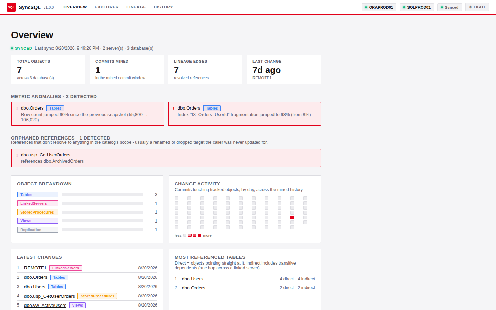

**Metrics anomalies & orphaned references** — flagged as alert cards near the
top of the Overview page: tables whose latest metrics snapshot swung sharply
(a row-count jump or an index fragmentation spike), and references that don't
resolve to anything in the catalog's scope, usually a renamed or dropped
target.

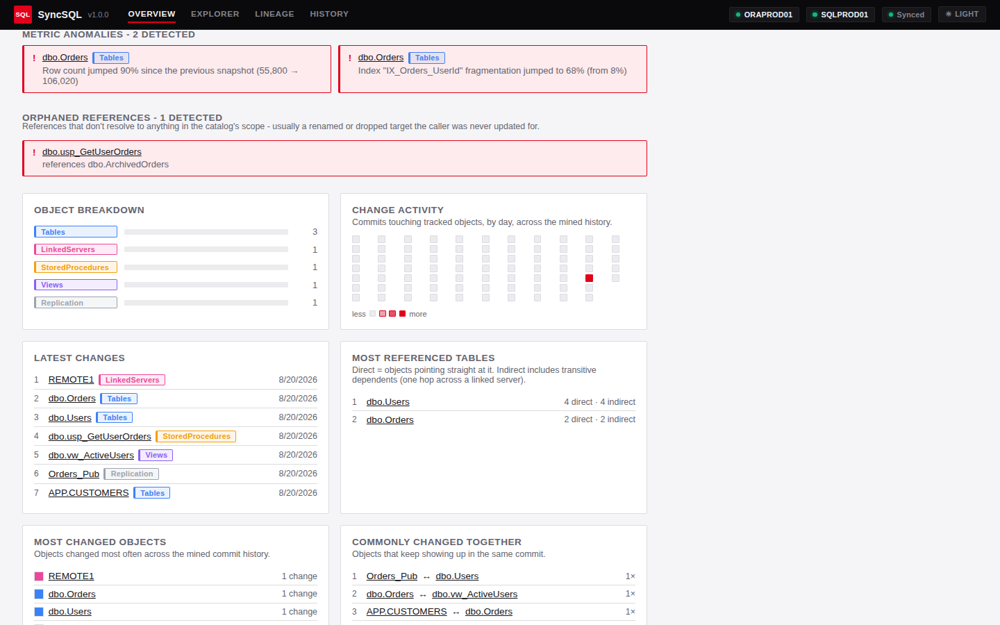

**Explorer** — a sortable, filterable table of every extracted object, with a
GitLab-style filter bar (attribute, operator, value).

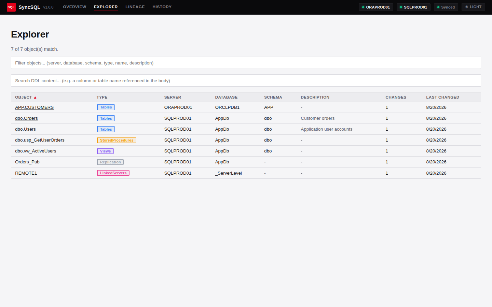

**DDL content search** — a separate search-as-you-type box live-filters
across every object's full DDL body, not just its metadata — e.g. "which
procs reference this column".

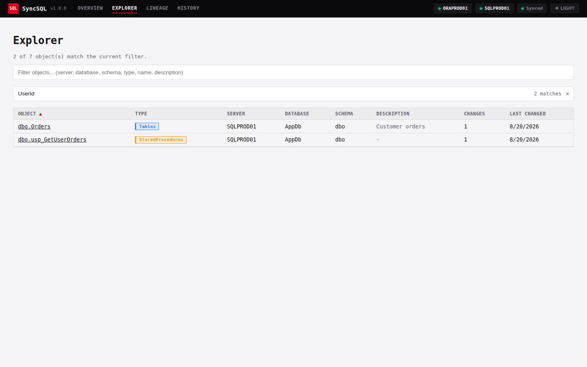

**Lineage graph** — an interactive dependency graph with drill-down, built
from a real SQL parser per engine, not text matching. Edges carrying a known
column reference are highlighted and labeled. The current filter/focus/hop
state stays live in the URL (**Copy link** for a shareable view), and
**Export SVG**/**Export PNG** render the visible graph to a standalone image.

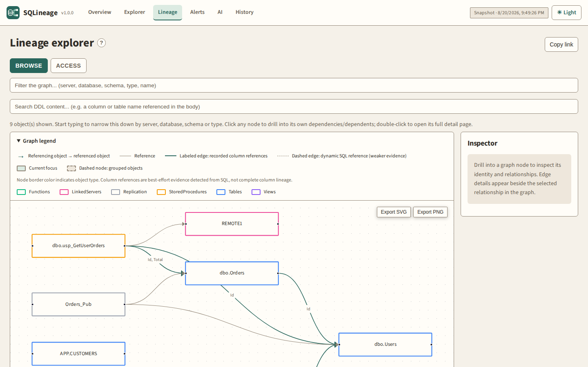

**Object detail** — a breadcrumb trail, a quick-facts bar (modified date,
deps, used-by, columns) with a jump to the lineage graph, full column list,
DDL, foreign keys / check constraints / indexes, and a metrics panel of
volume/index/optimizer-statistics trends.

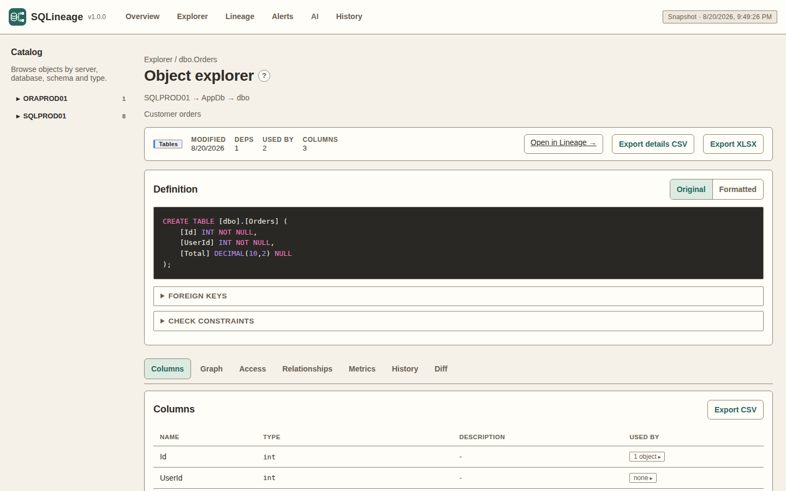

**Orphaned reference warning** — flagged directly on the referencing
object's own page, in addition to the Overview panel above.

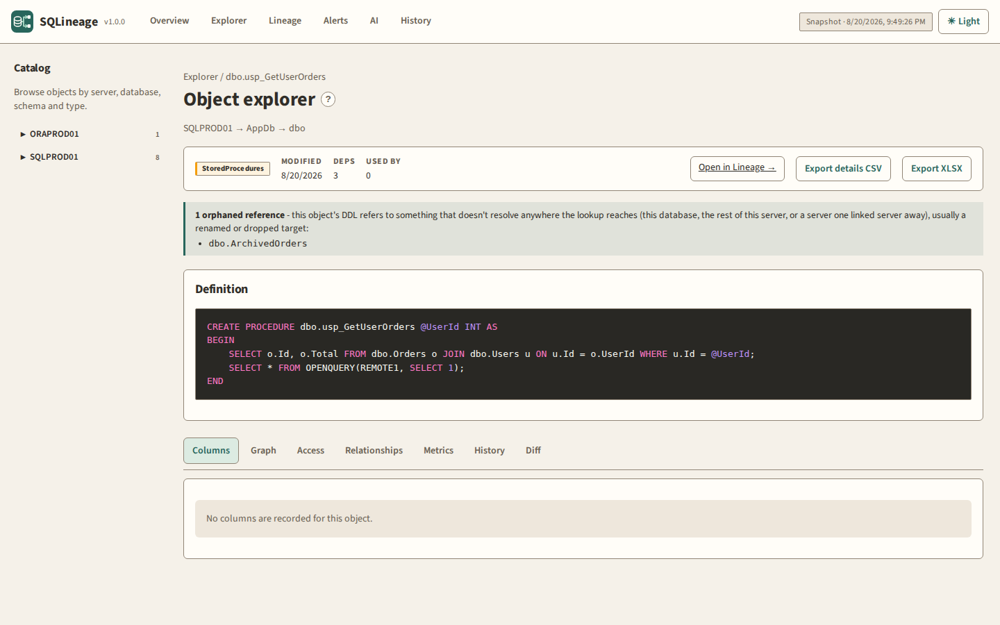

**Side-by-side revision diff** — compare mode in the change-history list
picks any two revisions (including the current definition) for a diff.

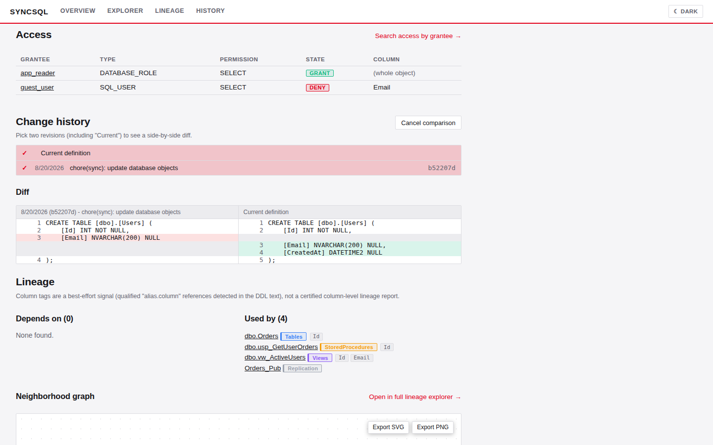

**In-app help** — every page's heading carries a **?** that opens that page's
own Markdown guide over the current view: what the page is for, what each
panel means, and where its data comes from. The guides live as `.md` files
in `site/src/help/` and are bundled with the site.

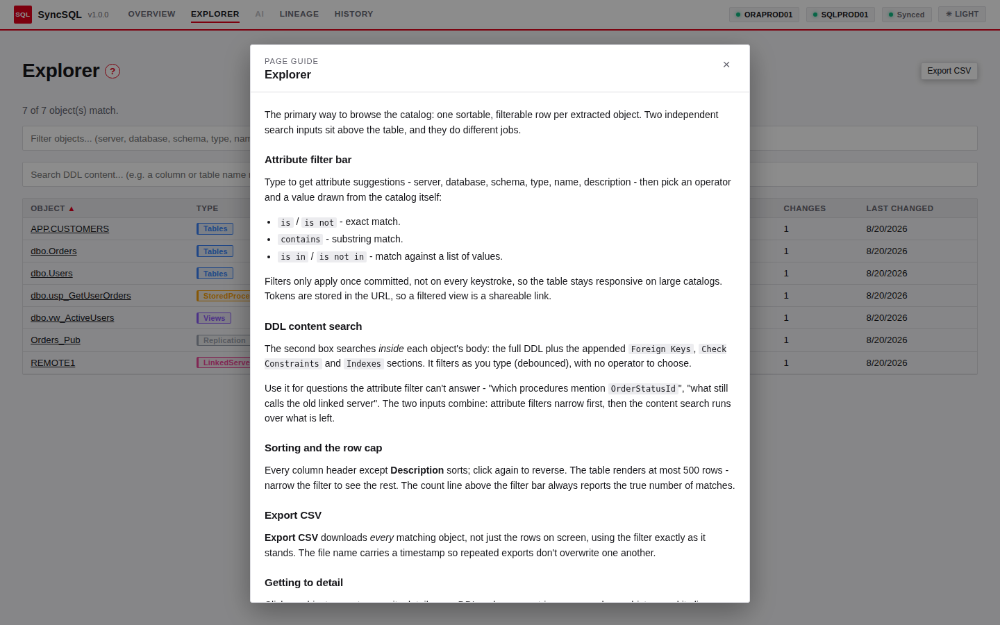

**Light and dark themes** — a toggle in the top right, persisted per browser.

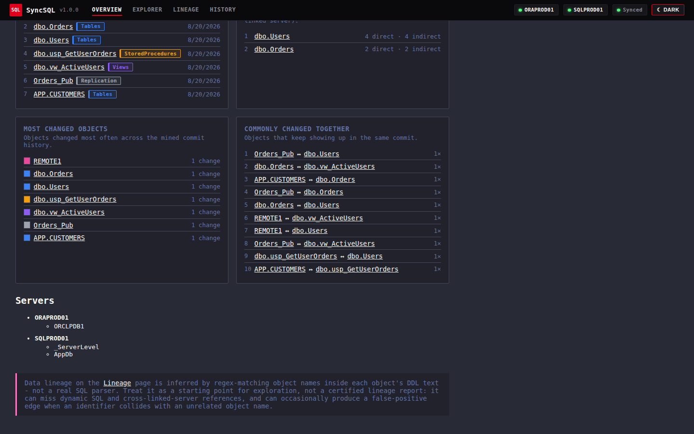

## How it works

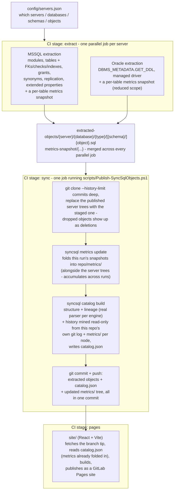

Extraction fans out across the fleet as independent parallel jobs (safe -
each always writes under its own server's path first, so different servers
never collide); a single job downloads the merged result and does the one
publish, so there's still exactly one commit and one push per run - see
[`.gitlab/README.md`](.gitlab/README.md) for the tradeoff that split buys
and the one-line fallback to a single sequential job for a small fleet.

Every extracted `.sql` file gets a small static header (server / database /
type / object name / engine) and nothing else — no timestamps — so
re-running the pipeline with no underlying database changes produces **zero
diff**.

## The syncsql CLI

`cli/` is a Clean/Onion-architecture .NET 10 solution: `SyncSql.Core` holds
domain records and abstractions with zero infrastructure dependencies;
`SyncSql.Extraction.MsSql`/`.Oracle`, `SyncSql.Lineage.MsSql`/`.Oracle`, and
`SyncSql.Catalog` each implement one of those abstractions; `SyncSql.Cli`
is the sole composition root, wiring everything via dependency injection
and exposing the commands below. Every project outside `SyncSql.Cli`
depends only inward on `SyncSql.Core`. There is no git-publish project or
abstraction anywhere in this solution - `syncsql` only reads and writes
local files (`SyncSql.Catalog`'s history mining is a read-only `git log`/
`git show`, never a write).

```
syncsql validate-config [--config <path>]
syncsql sync [--config <path>] [--output-root] [--staging-root] [--metrics-snapshot-root]
             [--db-user PREFIX=value] [--db-password PREFIX=value] [--credentials-file <path>]
             [--server-include/--server-exclude]
syncsql catalog build [--output-root] [--objects-root <path>] [--output <path>]
                       [--repo-root] [--path-prefix] [--history-limit]
                       [--max-versions-per-object] [--max-history-content-calls]
                       [--max-co-change-commit-size] [--metrics-root]
syncsql metrics update [--output-root] [--snapshot-root <path>] [--history-root <path>]
                        [--history-limit]
syncsql lint [--output-root] [--path <file-or-dir>...] [--fail-on warning|error]
```

Every input is a parameter, and every one of them has a local default:
credentials come from `--db-user`/`--db-password`/`--credentials-file`
(falling back to the `<prefix>_DB_USER`/`<prefix>_DB_PASSWORD` environment
variables, so existing setups keep working), and every output path defaults
to a folder under `--output-root` (`./syncsql-output`), so the four commands
chain together with no arguments at all outside CI.

`sync` extracts (purely local - no git of any kind); `catalog build` and
`metrics update` are the other two pure, composable steps (rebuild the
catalog, fold metrics history) - handy for local preview or rebuilding
`catalog.json` against a different history window without re-extracting.
`lint` is a fourth, database-free step: it parses T-SQL script(s) with the
same real `ScriptDom` parser `catalog build` uses for lineage and reports
syntax errors plus a few style/best-practice findings (`SELECT *`, `NOLOCK`
hints, cursor usage) - see [`cli/docs/cli.md`](cli/docs/cli.md) for the
full rule list.
Publishing results to git is
[`scripts/Publish-SyncSqlObjects.ps1`](scripts/Publish-SyncSqlObjects.ps1)'s
job - a PowerShell script the CI `sync` stage invokes with parameters, and
that you can run by hand the same way (`-SkipPush` for a dry run); see
[`.gitlab/README.md`](.gitlab/README.md). `syncsql` itself never clones,
commits, or pushes. Install it as a
[dotnet global tool](https://learn.microsoft.com/dotnet/core/tools/global-tools)
from the project's Nexus feed, or run it straight from source with
`dotnet run --project cli/src/SyncSql.Cli --`. Full option reference,
install instructions, and exit codes: [`cli/docs/cli.md`](cli/docs/cli.md).

Building from source needs the .NET 10 SDK and nothing else. The complete Oracle
PL/SQL parser is generated C# committed under [`grammar/`](grammar/README.md), so
`dotnet build cli/SyncSql.slnx` neither runs Java nor restores a private parser
package. Details:
[`cli/docs/cli.md`](cli/docs/cli.md)'s "Build prerequisites".

## Configuration

Copy `config/servers.example.json` to `config/servers.json` and edit it.
Nothing in that file is secret: it lists server hostnames and the regex
filters that decide what gets extracted. See the field descriptions below
for the full schema; in short:

- `git`: where extracted objects get pushed. Read and acted on by
  [`scripts/Publish-SyncSqlObjects.ps1`](scripts/Publish-SyncSqlObjects.ps1),
  where every field is also a parameter that overrides it - see
  [`.gitlab/README.md`](.gitlab/README.md) - `syncsql`
  itself never touches this block. Left blank (the default), objects are
  pushed back into **this same project**: the CI job passes a `-RemoteUrl`
  built from the predefined `CI_SERVER_*` variables — see
  [`.gitlab/README.md`](.gitlab/README.md)'s
  "Required CI/CD variables" for the token that requires. Set it to a
  full URL to push into a different project instead.

  `pathPrefix` says where inside that repository the extracted tree lives.
  It defaults to empty: the tree starts at the repository root, so the first
  path segment of every published file is the server it came from
  (`SQLPROD01/AppDb/Tables/dbo/Orders.sql`), with `catalog.json` and the
  `metrics/` history tree beside it. Set it to a folder name to nest the whole
  tree one level down instead - worth doing when you publish into a repository
  that holds other things too, and what an existing SyncSQL repository already
  did under `objects`.
- `defaults` / per-server overrides: `databases`, `schemas`,
  `objectNames` include/exclude regex lists, and an `objectTypes` list
  (`Schemas`, `Tables`, `Views`, `StoredProcedures`, `Functions`,
  `Triggers`, `Synonyms`, `LinkedServers`, `Replication` for MSSQL;
  `Schemas`, `Tables`, `Views`, `Procedures`, `Functions`, `Packages`,
  `PackageBodies`, `Triggers`, `Synonyms`, `DatabaseLinks` for Oracle).
  A server that specifies a key fully replaces the default for that key.
- `serverSelection`: regex filter over which of the listed servers
  actually run in a given pipeline execution (can also be overridden per
  run with `--server-include` / `--server-exclude`).
- `discovery.linkedServers`: whether a run also **follows the linked
  servers it finds** and extracts what's on the other side, instead of
  stopping at the servers listed by hand - see
  [Following linked servers](#following-linked-servers). Off by default.

Filtering is regex-based and works at every level mentioned in the
config: server, database, schema, and individual object name.

Credentials are **never** stored in the config. Each server entry has a
`credentialsVariablePrefix`, and `syncsql sync` resolves it from, in order,
`--db-user`/`--db-password PREFIX=value` parameters, a `--credentials-file`
JSON file, then the `<prefix>_DB_USER` / `<prefix>_DB_PASSWORD` environment
variables. The pipeline keeps the credentials in masked CI/CD variables
named that way and passes them to the CLI as parameters - see
[`cli/docs/cli.md`](cli/docs/cli.md)'s "Credentials".

## Development environment

### Prerequisites

| Tool | Version | Needed for |
|------|---------|------------|
| [.NET SDK](https://dotnet.microsoft.com/download) | **10.0** (pinned by [`global.json`](global.json)) | building, testing and running the `syncsql` CLI |
| [Node.js](https://nodejs.org/) | 20 or newer | building and testing the catalog site |
| Visual Studio 2026, VS Code, or Rider | see below | optional, but this repo ships editor config for VS Code |

The SDK is pinned in `global.json`, so `dotnet` fails with an explicit
"requested SDK version not found" rather than half-loading the solution if
.NET 10 is missing. `cli/SyncSql.slnx` is the [XML solution
format](https://devblogs.microsoft.com/dotnet/introducing-slnx-support-dotnet-cli/),
which needs Visual Studio 17.13+ (17.14+ to build `net10.0`) or a current
C# Dev Kit — older tooling does not recognise the file and will act as if
the repository contains no projects at all.

### Restore and run everything

```sh
# .NET CLI - note the solution lives in cli/, not at the repository root
cd cli
dotnet restore SyncSql.slnx
dotnet build   SyncSql.slnx
dotnet test    SyncSql.slnx

# Catalog site
cd ../site
npm install
npm test             # Vitest, single run
npx vitest           # Vitest, watch mode
npm run build        # typecheck, build, stage the vendored AI model
```

### Editors

[`.vscode/`](.vscode) is checked in (only the shared files — per-user state
stays ignored) and is what makes both test suites discoverable:

- **`settings.json`** sets `dotnet.defaultSolution` to `cli/SyncSql.slnx`
  and points the Vitest extension at `site/vitest.config.ts`.
- **`extensions.json`** recommends the two extensions that actually
  populate Test Explorer: **C# Dev Kit** (`ms-dotnettools.csdevkit`) and
  **Vitest** (`vitest.explorer`).
- **`tasks.json`** / **`launch.json`** provide build/test tasks and a debug
  target for the CLI.

Open the repository root; both suites appear in the Test Explorer view
(`View → Testing`).

#### Test Explorer shows no tests

The two suites are discovered by two different extensions, so they fail
independently.

**No .NET tests.** The usual cause is that the C# Dev Kit never loaded a
project. It only auto-discovers a solution sitting in the folder you
opened, and this repository's solution is one level down in `cli/`.

1. Install **C# Dev Kit** — the base C# extension alone does not provide
   Test Explorer integration.
2. Confirm `.vscode/settings.json` has
   `"dotnet.defaultSolution": "cli/SyncSql.slnx"`. Opening the `cli/`
   folder directly works too.
3. Run `dotnet --version` and check it reports 10.x. Under .NET 8 or 9 the
   `net10.0` projects fail to load and no tests are discovered.
4. Build once — `cd cli && dotnet build SyncSql.slnx`. Discovery runs
   against build output, so a solution that has never been built, or that
   fails to build, yields an empty list. `dotnet test SyncSql.slnx` from
   the terminal is the fastest way to tell a discovery problem (tests run
   fine here, but the tree is empty) from a real build break (this fails
   too).
5. `Developer: Reload Window`, then check `Output → C# Dev Kit` and
   `Output → .NET Test Log` for the actual error.

**No site tests.** Vitest config lives in
[`site/vitest.config.ts`](site/vitest.config.ts), not at the repository
root, so the extension has to be told where to find it.

1. Run `npm install` in `site/` — the Vitest extension does nothing until
   `vitest` is present in `node_modules`.
2. Install the **Vitest** extension (`vitest.explorer`).
3. Confirm `npm test` passes in `site/`. If it does and the tree is still
   empty, the extension is looking in the wrong place: check
   `vitest.rootConfig` in `.vscode/settings.json`, or open the `site/`
   folder directly.
4. Test files must be named `*.test.ts` / `*.test.tsx` (Vitest's default
   glob) — a file named `*.tests.ts` is not picked up.

## CI/CD pipeline

The pipeline (`.gitlab-ci.yml` and the modules it includes under
`.gitlab/ci/`) is what actually runs the flow described above: validating
`config/servers.json`, running the extraction jobs, publishing results to
git, and building/deploying the catalog site. Required CI/CD variables,
trigger rules, and a job-by-job explanation - including the `syncsql`
tool's own build/publish pipeline - are documented in
**[`.gitlab/README.md`](.gitlab/README.md)**; set the required variables
there before running it, and see it for how to fall back to a single
sequential extraction job for a small fleet.

The pipeline holds configuration, not logic: every path, limit, and
credential it defines is passed to `syncsql` or to
[`scripts/Publish-SyncSqlObjects.ps1`](scripts/Publish-SyncSqlObjects.ps1)
as an explicit parameter, and neither reads a CI variable of its own. That
is what makes the same steps runnable, and dry-runnable, from a workstation.

### GitHub Actions

[`.github/workflows/ci.yml`](.github/workflows/ci.yml) covers the build-and-test
half on GitHub, for pushes to `main`, pull requests, and manual runs:

| Job                | What it runs |
|--------------------|--------------|
| `cli`              | `dotnet format --verify-no-changes`, `dotnet build`, `dotnet test` over `cli/SyncSql.slnx` (test results uploaded as a `.trx` artifact). |
| `site`             | `npm ci`, browser/unit tests, strict verification of the Git LFS-backed local AI model, and the typechecked Vite build in `site/`. |
| `publish-script`   | Parses `scripts/Publish-SyncSqlObjects.ps1` and checks it against PSScriptAnalyzer's Windows PowerShell 5.1 syntax rules. |

It deliberately stops there: extraction, publishing to git, and the Pages
deploy stay in GitLab CI, since those are the jobs that need database
credentials, a push token, and a schedule. Nothing in this workflow touches
a database, a credential, or a git remote.

## The catalog / lineage site

`site/` is a React + TypeScript + Vite app (source checked into this repo,
built fresh by the `pages` job on every scheduled run), styled as a dense
data-terminal with a light/dark toggle (top right; light is the default -
see "Theme" below). Every page carries a **?** next to its heading that
opens that page's own Markdown guide without leaving the view (see
"In-app help" below):

- **Overview** — a quick-stats row (objects, commits mined, lineage edges,
  last change), a per-type change-activity heatmap (one row per object type
  with its own color, one cell per week over the mined history, doubling as
  the object-count-by-type breakdown), the 10 most recently changed objects,
  the most-referenced tables (direct incoming edges and indirect/transitive
  reachability, capped to one hop across a linked-server boundary), objects
  that tend to change together in the same commit, a **metrics anomalies**
  panel flagging tables whose latest metrics snapshot swung sharply versus
  the previous one (a row-count jump/drop or an index fragmentation spike —
  see "Volatile metrics" below), and an **orphaned references** panel (see
  "Orphaned reference detection" below).
- **Explorer** — a sortable, filterable table listing every object; it's the
  primary way to browse the catalog. A separate DDL content search box
  live-filters (search-as-you-type, debounced) across every object's full
  DDL body plus its appended sections (Foreign Keys, Check Constraints,
  Indexes, ...) — e.g. "which procs reference this column" — distinct from
  the attribute filter bar above it, which only matches server/database/
  schema/type/name/description.
- **AI** (`/#/ai`) — an optional, entirely browser-local assistant that turns
  an English request into a preview of validated Explorer filters and one DDL
  content query. It uses the quantized `all-MiniLM-L6-v2` model only to
  classify ambiguous filter intent; a deterministic catalog-aware planner
  resolves values and operators, and never generates or executes SQL. The
  model is fetched from the same Pages origin on the first request. If a
  deployment omits the model, the tab remains visible but disabled and the
  rest of the site is unaffected.
- **Object detail** — qualified name, `sys.extended_properties` descriptions
  (object + column level, MSSQL only), the full structural column list with
  data types (Tables/Views), an **orphaned reference** warning when this
  object's own DDL refers to something unresolved (see "Orphaned reference
  detection" below), the DDL, structured panels for any Foreign Keys
  / Check Constraints / Indexes sections, a **Metrics** panel of volume/
  index/optimizer-statistics trend graphs for tables (see "Volatile
  metrics" below), an **Access** panel (see "Grant mapping" below), a
  change-history list with a point-in-time viewer plus a **compare mode**
  that picks any two revisions (including the current definition) for a
  side-by-side diff, and "depends on" / "used by" lineage lists annotated
  with column tags (expandable past the first few) with an embedded
  neighborhood graph. Hub objects are handled specially — see "Objects with
  too many dependencies" below.
- **Lineage** (`/#/lineage`) — a full graph explorer rendered with
  `@xyflow/react` + `dagre` auto-layout, with two modes (tabs):
  - **Browse** — the object filter bar and a DDL content search box (same
    as Explorer's) together drive which objects are shown. Clicking a node
    drills the graph into that object's own neighborhood in place
    (breadcrumb trail, Back button, adjustable 1/2/3-hop radius) rather than
    leaving the page; double-click opens that object's full detail page. An
    object page's "Open in full lineage explorer" link lands here with an
    actual filter token seeded for that object, so clearing the drill-down
    focus narrows back to it instead of dumping out to the whole catalog.
    The current filter tokens, drill-down focus, hop radius, and content
    search are all kept live in the URL, so **Copy link** hands over an
    exact, shareable snapshot of the current view — handy for incident
    write-ups or design docs referencing a specific dependency chain.
  - **Access** — search by grantee (user, role or group) to see every
    object they have a GRANT or DENY permission on, down to the column when
    scoped that way (see "Grant mapping" below); matches are listed in a
    table and rendered in the same graph, so you can drill from "what can
    this principal touch" straight into how those objects relate.

  Edges carrying a known column-level reference (see "Column dependency
  tracking" below) are highlighted, labeled with up to 3 referenced column
  names, and clickable — click one to open a detail panel with the full
  column list for that edge. **Export SVG**/**Export PNG** render the
  currently visible graph to a standalone image (built directly from node
  positions rather than rasterizing the live page, so it renders correctly
  outside the site and matches whichever theme is active) for dropping into
  an incident write-up or design doc.
- **History** — a global commit timeline of everything the pipeline has
  changed, expandable per commit.

All of Explorer/Lineage's filter bar share one GitLab-style filter bar: type
to get attribute suggestions (server, database, schema, type, name,
description), pick an operator (is / is not / contains / is in / is not
in), then pick from suggested values pulled from the catalog. Suggestion
lookups are capped and debounced, and committed filters (not keystrokes)
are what actually re-filter the object list, so it stays responsive on
large catalogs. The DDL content search box next to it is separate and
lighter-weight by design: it live-filters as you type (no attribute/operator
to pick, no commit step) since it's meant for a quick "does this term appear
in any object's body" pass rather than a precise structured filter.

**Lineage inference uses a real parser for each engine, not text
matching.** `syncsql` tags every extracted object with the engine that
produced it (a `-- Engine:   mssql`/`oracle` header line written into every
extracted `.sql` file, alongside `-- Server:`/`-- Database:`/etc.) and
dispatches to that engine's analyzer when building the catalog:

- **MSSQL** objects are parsed with `Microsoft.SqlServer.TransactSql.ScriptDom`
  (a direct NuGet dependency of `SyncSql.Lineage.MsSql`, real T-SQL AST, not
  text matching): table/view references, schema-qualified function calls,
  `EXEC`/`EXECUTE` targets, `FOREIGN KEY ... REFERENCES` targets, and
  column references bound to their actual FROM-clause alias are all read
  straight off the parse tree.
- **Oracle** objects are parsed with a real ANTLR4 PL/SQL grammar
  (`SyncSql.Lineage.Oracle` vendors the `.g4` grammar files from
  [antlr/grammars-v4](https://github.com/antlr/grammars-v4); its generated C#
  lexer/parser/visitor is committed and compiled directly, so building and
  testing need no Java toolchain or private parser feed - see
  [`grammar/README.md`](grammar/README.md))
  - the same real-AST treatment as MSSQL: table/view references, package/
    procedure/function calls (including schema-qualified and `call_statement`
    invocations), `FOREIGN KEY` references, and alias-bound column
    references are all read off the parse tree.

Neither engine matches identifiers inside string literals or comments
(including Oracle's `q'...'` alternative quoting), misreads `SELECT *`/
computed columns as references, or guesses an alias's target from nearby
text rather than the parser's own binding. Any node missing an `Engine` tag
(an extraction from before that header field existed) is simply skipped for
lineage inference rather than guessed at.

A reference that names a database or a linked server / database link keeps
those qualifiers and is resolved against them - see
[Where a reference is looked up](#where-a-reference-is-looked-up) - with the
link itself drawn as an explicit hop in the graph rather than an invisible
one.

None of this is a certified lineage report - it will still miss dynamic SQL
and anything built at runtime, and a traversal that crosses a linked-server/
DB-link boundary (in the "most referenced indirectly" analytics) still stops
one hop past that boundary rather than fanning out across a remote server's
own dependency graph. The site says as much on its overview page.

There is no separate tree sidebar (Server → Database → Schema → Type →
Object) — Explorer's filter bar plus sortable columns cover browsing, and
every other page (Lineage, Overview, History) links directly to object
detail pages.

### In-app help

Every page's heading carries a **?** button. It opens that page's guide -
what the page is for, what each panel means, which control does what, and
where the data behind it comes from - in a dialog over the current view, so
the filters, drill-down and scroll position you were working with survive
reading the help. `Esc`, the close button, or a click outside dismisses it.

The guides are ordinary Markdown files, one per screen, living next to the
app code:

```
site/src/help/overview.md    Overview
site/src/help/explorer.md    Explorer
site/src/help/ai.md          AI filter assistant
site/src/help/lineage.md     Lineage explorer
site/src/help/history.md     History
site/src/help/object.md      Object detail
```

They are inlined into the bundle at build time (Vite's `?raw` import) rather
than fetched at runtime, so help works on a Pages deployment served from a
subpath the build doesn't know about, and keeps working offline once the
site has loaded. `site/src/help/index.ts` maps each screen to its file and
splits the document's leading `#` heading off to use as the dialog title -
the `.md` files stay complete, readable documents on their own.

Rendering is done by a small Markdown subset of our own
(`site/src/lib/markdown.ts` + `site/src/components/Markdown.tsx`): headings,
paragraphs, lists, fenced code and inline code/bold/italic/link. It exists
instead of a Markdown dependency because the guides are content we write
ourselves, and it renders to real React elements - never
`dangerouslySetInnerHTML` - with link hrefs restricted to http(s), `mailto:`
and in-site routes.

To edit a guide, edit its `.md` file; nothing else needs touching. To add a
screen: drop a new `.md` next to the others, add it to the `HelpTopic` union
and the `helpGuides` map in `site/src/help/index.ts`, and render
`<HelpButton topic="..." />` inside that page's `<h1 className="page-title">`.

### Theme

A light/dark toggle lives in the top right of every page (`lib/ThemeContext.tsx`),
persisted to `localStorage`. Light is the default, styled around the
SyncSQL brand red. Dark uses **"Midnight"** — a dark, purple-tinted palette
in the style of a well-known VS Code dark theme (background/foreground/
comment/accent colors all drawn from it, pink standing in for brand red as
the accent). DDL/code blocks are the one deliberate exception — always
rendered in the Midnight palette (`components/midnight-hljs.css`, a
hand-mapped `highlight.js` theme) regardless of which site theme is active,
so SQL stays legible with one consistent look. The Lineage graph
(`@xyflow/react`) follows the site theme too, defaulting to light along
with everything else.

### Grant mapping

The catalog builder parses a per-object "Grants" section (attached by the
extraction backend, best-effort - see "Known limitations" below) into a
structured `grants` list on each catalog node: grantee, grantee type (MSSQL
only - `SQL_USER`, `DATABASE_ROLE`, `WINDOWS_GROUP`, ...), permission
(`SELECT`, `EXECUTE`, ...), state (`GRANT`/`DENY` - MSSQL only, Oracle has
no DENY concept), and the column when the grant was scoped to one rather
than the whole object.

- MSSQL: `sys.database_permissions` (object/column-level, class =
  `OBJECT_OR_COLUMN`) joined to `sys.database_principals` for the grantee
  and its type.
- Oracle: `ALL_TAB_PRIVS` (object-level) and `ALL_COL_PRIVS`
  (column-level) for every object owned by each extracted schema.

Every object's detail page has an **Access** panel (below the DDL and its
appended sections, above Change history) listing its own grants; the
Lineage page's **Access** tab flips the query around - search by grantee to
see every object (and, when scoped, column) that principal can touch, both
in a table and in the graph. Both degrade to "no grants" rather than
failing extraction when the underlying permissions view isn't accessible to
the connecting account.

### Volatile metrics

Row counts, index fragmentation/usage, and the statistics the query
optimizer actually consults for cardinality estimation all change on every
run by nature - embedding them in an object's own extracted `.sql` file
would turn "zero diff when nothing changed" into "diff every single run"
for every table, which defeats the point of versioning the objects at all.
So this data is tracked as its own accumulating time series instead,
entirely separate from the object's version history:

- Each extraction backend captures one metrics snapshot per table per run,
  staged separately and never mixed into the object's own `.sql` file:
  - **Volume**: row count and reserved/data/index size in KB (MSSQL:
    `sys.dm_db_partition_stats` + `sys.allocation_units`, the same
    aggregation `sp_spaceused` uses; Oracle: `ALL_TAB_STATISTICS`, size
    estimated as `BLOCKS * 8KB` rather than read from `DBA_SEGMENTS`, to
    avoid needing elevated privileges).
  - **Index metrics**: MSSQL gets fragmentation % and page count
    (`sys.dm_db_index_physical_stats`, cheap `'LIMITED'` mode) plus
    always-on usage counters - seeks/scans/lookups/updates
    (`sys.dm_db_index_usage_stats`, which itself resets on service
    restart, so this is inherently a point-in-time reading, not a durable
    fact). Oracle gets row count/distinct keys/leaf blocks
    (`ALL_IND_STATISTICS`) - it has no equivalent of MSSQL's always-on
    per-index usage counters without enabling the Diagnostics Pack, so
    seeks/scans/lookups/updates are simply absent for Oracle indexes.
  - **Optimizer statistics** - the actual histogram/density summary the
    query optimizer uses, not the `CREATE STATISTICS` object definition:
    rows, rows sampled, histogram step count, modification counter (rows
    changed since the last refresh) and last-updated time (MSSQL:
    `sys.dm_db_stats_properties`; Oracle has no separate named
    stats-object abstraction - the table stats *are* what the optimizer
    uses, so this is a single synthetic entry per table, with the
    modification counter summed from `ALL_TAB_MODIFICATIONS` when
    available).
- `syncsql metrics update` runs inside the same git checkout the catalog
  builder uses, but writes to `<repo>/metrics/` - a tree kept entirely
  outside `config.git.pathPrefix`, so the CI pipeline's
  wipe-and-replace of the object tree never touches it. Each run appends
  this run's snapshot to the existing history array per table and trims it
  to `--history-limit` (default 90, override via the `METRICS_HISTORY_LIMIT`
  CI variable / `metrics update --history-limit`) - so the object's own file
  stays diff-free while `metrics/` accumulates real history.
- `syncsql catalog build` reads that same `metrics/` tree and attaches it
  as `node.metrics` in `catalog.json`, so the site never needs a second
  fetch.

Every object's detail page shows this as a **Metrics** panel (row count,
size, index fragmentation/usage, and optimizer-statistics graphs, plus the
latest snapshot's statistics table) whenever a table has history to show;
it's simply absent for objects with none. Every one of these queries
degrades independently (with a warning) rather than failing extraction, the
same posture as every other optional extraction step in this project - and
that split matters here, because they don't all need the same rights: row
counts and sizes come from catalog views any reader can see, while the index
and optimizer-statistics DMVs need `VIEW DATABASE STATE` (or `VIEW SERVER
STATE`). An extraction login without it still gets volume metrics; the DMV
parts are skipped with a warning naming the permission.

Tables dropped from the source database keep their existing metrics history
file rather than being cleaned up - a minor storage cost, not a correctness
issue.

### Column dependency tracking

Tables and views get a full structural column list (name + data type),
independent of whether a column happens to have an
`sys.extended_properties`/documentation entry - `sys.columns` (MSSQL) /
`ALL_TAB_COLUMNS` (Oracle). The catalog builder then checks each inferred
edge's source object for `alias.column` references against the target's
column list, and records which of the target's columns are actually
referenced on that edge - using each engine's own analyzer for both the
edge and the alias binding, so `alias.column` resolves to the exact table
that alias was declared against on the parse tree, not a guess from nearby
text. This still isn't a certified column-level lineage report - it will
miss dynamic SQL, `SELECT *`, and computed/aliased column expressions.

This shows up as column tags next to each entry in an object's "depends
on"/"used by" lists, and as highlighted, labeled edges in the Lineage
graph.

### Where a reference is looked up

A reference found in one object's DDL is resolved by widening outwards, in
the order a reader of that DDL would:

1. **The qualifiers the reference itself carries.** T-SQL's three- and
   four-part names (`OtherDb.dbo.Orders`, `LNK.OtherDb.dbo.Orders`) and
   PL/SQL's `app.orders@LNK` say exactly where to look, so the parsers keep
   the database and linked-server/DB-link parts instead of collapsing them
   to `dbo.Orders`.
2. **The object's own database**, for a reference that named none.
3. **The other databases on the same server** - a schema-qualified name
   that resolves nowhere in its own database, but to exactly one object
   elsewhere on that server, resolves there.
4. **The servers one link away** - the last resort, and only for a unique
   match across all of them.

A linked server / database link is mapped onto a catalog server through the
link object the extraction already collected: MSSQL's `sp_addlinkedserver`
carries the link's `@datasrc` and `@catalog`, Oracle's `CREATE DATABASE
LINK` its `USING` connect string. Since a link points at a *host* while the
catalog is keyed by the *configured server name*, a link matches a server
whose name equals the link's own name, its data source, or the host part of
that data source (port, instance and DNS suffix trimmed).

Widening only ever settles on a **unique** match. Two candidates are
reported as ambiguous rather than guessed at, a schema-qualified reference
is never downgraded to a bare-name guess, and a bare name (no schema at
all) never crosses a server boundary - it's too weak a signal to carry that
far.

### Orphaned reference detection

Cheap to compute once lineage inference has run: every reference that
resolves nowhere the lookup above can reach is collected as an **orphaned
reference** rather than just silently producing no edge. In practice this is
almost always a real bug worth flagging - the referenced
table/view/procedure was renamed or dropped and the object still calling it
was never updated - though it can occasionally be a false positive: dynamic
SQL, a system object, or a name built at runtime.

Two situations are deliberately **not** flagged this way, because neither
means "the target is missing":

- A reference that's merely *ambiguous* - more than one same-named object in
  scope. The target clearly exists, it just can't be resolved uniquely from
  a bare name, and conflating the two would bury real orphaned references in
  noise from otherwise-benign naming collisions.
- A reference that lands **outside what was extracted** - a link nothing in
  the catalog answers to, or a database nobody extracts. Nothing is
  dangling there; the target simply isn't in the catalog. Where a link was
  involved, it's recorded against that link instead (see
  [Linked servers as lineage hops](#linked-servers-as-lineage-hops)), so it
  stays visible without being counted as a bug.

`syncsql catalog build` writes these to `catalog.json`'s
`orphanedReferences` array (`from`/`server`/`database`/`schema`/`name`) and
logs a summary count as a warning. The site surfaces them in two places: an
Overview panel listing every orphaned reference across the catalog, and a
warning banner on the referencing object's own detail page.

### Linked servers as lineage hops

A reference that crosses a linked server / database link doesn't become a
direct edge to the remote object. It becomes **two** edges - caller → link,
link → remote object - so the link is a visible hop in the lineage graph
rather than an invisible one, and a hop that leaves the catalog's scope
(the remote object isn't extracted) still shows the caller depending on the
link.

Every such reference is also written to `catalog.json`'s
`linkedServerReferences` array (`linkedServer`/`from`/`to`/`database`/
`schema`/`name`, with `to` null when the target isn't extracted). The link
object's own detail page turns that into a table of **everything referenced
through this linked server** - one row per remote object, with the objects
that reach it - and each referencing object's page lists the remote objects
it reaches and the link it goes through.

### Following linked servers

By default `syncsql sync` extracts exactly the servers `config/servers.json`
lists. With `discovery.linkedServers.enabled`, it also follows the linked
servers it finds on those servers and extracts what's on the other side,
reusing **the same credentials** - the follow-up server inherits its
parent's `credentialsVariablePrefix`, along with its port, TLS settings, and
schema/objectName/objectType filters:

```json
"discovery": {
  "linkedServers": {
    "enabled": true,
    "maxDepth": 1,
    "requireMatchingLogin": true,
    "restrictToLinkedCatalog": true,
    "linkNames": { "include": [".*"], "exclude": [] }
  }
}
```

- `maxDepth` - how many links deep to go. 1 extracts the servers the
  configured ones link to; 2 also the ones *those* link to. 0 disables it.
- `requireMatchingLogin` - only follow a link whose remote login is the
  username already in hand, or that passes the local login through
  (`uses_self_credential`). Since the credentials are reused as-is, a link
  mapped to some *other* remote login is the catalog telling you those
  credentials aren't the right ones there. Turn it off to try anyway.
- `restrictToLinkedCatalog` - when a link pins a database
  (`sp_addlinkedserver`'s `@catalog`), extract only that database on the far
  side. A link that names a catalog points at one database, not the whole
  instance.
- `linkNames` - the usual regex include/exclude, over link names.

Links that aren't SQL Server (`product`/`provider`), that declare no data
source, or that lead somewhere a configured server already covers are
skipped, each with a logged reason. Discovered servers are named after the
link (suffixed if that collides with a configured name), which is also what
their output path segment becomes. Oracle database links aren't followed:
an Oracle connection needs a service name that a link's connect string
doesn't reliably provide.

Each follow-up opens a connection to a host nobody listed by hand, which is
why this is opt-in - and why the credentials rule above is on by default.

### History, heatmap and point-in-time

A static Pages site can't run live `git` queries, so the catalog builder
mines history *during the sync CI stage* instead, right before committing:
`sync-database-objects`'s shell script clones the target repo deeply
enough (`--depth`/`--history-limit` commits, default 250 — override via
the `HISTORY_LIMIT` CI variable) for `syncsql catalog build` to mine it
(`--repo-root`, read-only - `git log`/`git show`, no writes), and the
resulting `catalog.json` is written straight into that same checkout and
committed alongside the objects it describes - so it's versioned in git
history too, not just a CI artifact that disappears after the job
expires. Mining history produces:

- a global commit timeline (the History page and Overview's "latest
  changes"),
- per-object change counts / last-changed dates (Explorer columns, the
  heatmap),
- co-change pairs — objects that keep showing up in the same commit,
- and a bounded per-object version history with DDL content fetched via
  `git show`, powering the "view this object as of a past commit" selector
  on the object detail page.

This is **not** a full whole-database time machine — reconstructing the
entire catalog (including lineage) at every historical commit would mean
re-running the whole analysis per commit, which doesn't fit a scheduled
CI job. What you get is real historical DDL per object within the mined
commit window, plus a commit-level view of what changed together, which
covers the practical "what changed and when" questions without that cost.
Running `syncsql catalog build` without `--repo-root` (no repo to mine)
simply omits all of this — empty history, zero change counts — rather
than failing.

To work on the site locally:

```sh
cd site
npm install
npm run dev     # dev server
npm run test    # Vitest, watch mode
```

`site/public/data/catalog.json` ships a small demo fixture so `npm run dev`
has something to render before any pipeline has actually run; replace it
with a real one (see below) to preview actual data.

The development server is model-free by default. To exercise AI locally,
materialize the Git LFS files, verify them, and preview a production build:

```sh
git lfs pull
cd site
npm run verify:ai-model
npm run build
npm run preview
```

`npm run build` packages AI in optional mode: a missing LFS object produces a
warning and an `available: false` capability manifest, but the core site still
builds. GitHub Actions runs `verify:ai-model` first and fails on missing,
unresolved, or modified model files. The GitLab Pages job deliberately keeps
the optional behavior so catalog publishing is not blocked by LFS or proxy
availability. Vendored sources and checksums live under
`site/vendor/ai/all-MiniLM-L6-v2/`; only verified files are copied to `dist`.

### Objects with too many dependencies

A dispatcher procedure with three hundred dependencies, or a core table five
hundred objects read from, breaks every "just list them" design: a flat list
of links answers no question anybody actually has about a hub, and a graph
with that many nodes is a hairball that takes a second to lay out and can't
be read afterwards. Three places adapt instead of degrading:

- **Object detail, "Depends on" / "Used by"** — up to a dozen entries these
  stay the plain list they always were. Past that they switch to a
  summary-first panel: a per-type breakdown (`Tables 212`, `Views 9`,
  `StoredProcedures 3`) that doubles as a one-click type filter, a search box
  matching any part of a related object's identity (server, database, schema,
  type or name), a **Group by** selector (type / database / schema / server),
  and collapsible groups — expanded from the top until the page has enough
  rows to be worth reading, each capped with a "Show all N".
- **Neighborhood and lineage graphs** — a focused graph over its node budget
  collapses same-type neighbours into a single dashed node carrying the count
  (`212 Tables`), wired to the focus in the direction its members sit. Small
  groups are collapsed last, so the two procedures and one trigger around a
  hub stay individually visible while the two hundred tables become one node.
  Clicking a bundle lists what's inside it rather than expanding it in place —
  expanding it would just rebuild the hairball, and the lists above are where
  every name is meant to be read.
- **Lineage explorer, over-sized selections** — a filter matching more objects
  than the graph will draw no longer dead-ends on a warning. It shows what the
  selection is actually made of — counts by server, by database and by type —
  with every row a one-click narrowing of the filter.

### CSV export

Anywhere the site shows a list worth taking elsewhere, an **Export CSV**
button writes exactly the rows currently on screen:

| Where | What the file holds |
|-------|---------------------|
| Explorer | Every object matching the current filter — identity, description, size, dependency/dependent counts, change count, last changed. The whole filter, not just the first 500 rows the table renders. |
| Object detail, header | That one object's details, same columns. |
| Object detail, Columns | Column name, data type, description. |
| Object detail, Access | Grantee, grantee type, permission, state, column. |
| Object detail, Lineage | Both directions as flat rows — direction, target identity, and the column-level tags for that edge. |
| Lineage → Access | One row per permission across every object matching the grantee search. |

Files are UTF-8 **with a BOM** (without it Excel reads them in the machine's
ANSI codepage and mangles every accented object name and description) and
CRLF-terminated per RFC 4180. Cell values that a spreadsheet would otherwise
evaluate as a formula are prefixed with an apostrophe, since this content
comes straight out of somebody's database.

## Running the extraction locally

Nothing here needs CI, and nothing needs to be exported: credentials and
paths are all parameters, and the paths have local defaults.

```bash
cat > ~/.syncsql-credentials.json <<'JSON'
{ "SQLPROD01": { "user": "svc_syncsql", "password": "..." } }
JSON
chmod 600 ~/.syncsql-credentials.json

syncsql sync --credentials-file ~/.syncsql-credentials.json
```

(or `--db-user SQLPROD01=svc_syncsql --db-password SQLPROD01=...`, or the
`SQLPROD01_DB_USER`/`SQLPROD01_DB_PASSWORD` environment variables - all
three work.)

`sync` is purely local: with no path parameters it reads
`./config/servers.json` and leaves extracted objects under
`./syncsql-output` — starting at the server name, e.g.
`./syncsql-output/SQLPROD01/AppDb/Tables/dbo/Orders.sql` — and metrics
snapshots under `./syncsql-output/metrics-snapshot` (`--staging-root` /
`--metrics-snapshot-root` / `--output-root` override that). The other
commands default to the same layout, so the chain needs no arguments:

```bash
syncsql metrics update                                        # → ./syncsql-output/metrics
syncsql catalog build --metrics-root ./syncsql-output/metrics # → ./syncsql-output/catalog.json
```

To preview the site against a run, write the catalog where the site reads it:

```bash
syncsql catalog build --output ./site/public/data/catalog.json
```

(add `--repo-root`/`--path-prefix` pointed at a real git checkout of your
target repo to include history; `--metrics-root` includes accumulated
metrics - real trend graphs need several runs' worth of history in a real
`metrics/` tree, so a single local run only shows a single data point per
chart), then `npm run dev` inside `site/`. See
[`cli/docs/cli.md`](cli/docs/cli.md) for every option and install
instructions (the `syncsql` global tool, or
`dotnet run --project cli/src/SyncSql.Cli --` straight from source).

To publish a local run into a git repository exactly the way CI does -
including the dry run that stops before committing:

```powershell
pwsh ./scripts/Publish-SyncSqlObjects.ps1 `
  -ExtractedObjectsDir ./syncsql-output `
  -MetricsSnapshotDir ./syncsql-output/metrics-snapshot `
  -ConfigPath ./config/servers.json `
  -SkipPush
```

The script targets Windows PowerShell 5.1, so `powershell.exe` runs it on a
stock Windows box; `pwsh` (PowerShell 7+) runs the same file everywhere else.

## Known limitations

- MSSQL table DDL (columns, identity, defaults, primary key) is
  reconstructed from catalog views since SQL Server doesn't store table
  definitions as text the way it does for procedures/views. Foreign keys,
  check constraints and non-PK indexes are captured too, but as separate
  appended sections rather than folded into the `CREATE TABLE` statement
  itself. (Statistics *objects* - `CREATE STATISTICS` definitions - are no
  longer extracted as DDL at all; see "Volatile metrics" above for what
  replaced them and why.)
- MSSQL server-scoped DDL triggers are not extracted, only database-level
  DML/DDL triggers (covered by `sys.sql_modules`).
- `sys.extended_properties` extraction (MSSQL) covers object- and
  column-level properties (class 1) only — database- and schema-level
  properties are not collected.
- MSSQL replication extraction covers publications and their articles
  only (best-effort, requires `dbo.syspublications`/`dbo.sysarticles` to
  exist and be readable) — subscriber enumeration is intentionally left
  out since subscription table shapes vary too much across SQL Server
  versions/topologies to guess at reliably.
- Oracle `DatabaseLinks` extraction requires privileges on `SYS.LINK$`
  (or equivalent); without them, that object type is skipped with a
  warning rather than failing the whole run.
- Linked server / database link passwords are never extracted (not
  readable from the catalog) — the generated script has a placeholder
  that must be filled in manually if ever used to recreate the link.
- Lineage inference (both engines - see "Lineage inference uses a real
  parser" above) will still miss dynamic SQL and anything built at
  runtime, including four-part cross-linked-server names constructed at
  runtime rather than written literally.
- Grant extraction (MSSQL `sys.database_permissions`, Oracle
  `ALL_TAB_PRIVS`/`ALL_COL_PRIVS`) only covers object/column-level grants
  on the extracted objects themselves — server/database-level permissions,
  role membership, and (Oracle) whether a grantee is itself a user or a
  role are out of scope. See "Grant mapping" above.
- History/heatmap/point-in-time only cover the mined commit window
  (`HISTORY_LIMIT`, default 250 commits) and only reconstruct individual
  objects' DDL, not a full historical catalog snapshot — see "History,
  heatmap and point-in-time" above.
- Volatile metrics only cover **Tables** (not Views, which have no physical
  storage/indexes of their own to measure) and only retain the last
  `METRICS_HISTORY_LIMIT` snapshots (default 90) per table. Oracle's
  version is reduced-scope versus MSSQL's - no index fragmentation or
  usage counters (needs the Diagnostics Pack), and size is an 8KB-block
  estimate rather than exact segment bytes. A table dropped from the
  source database keeps its existing metrics history rather than being
  cleaned up. See "Volatile metrics" above.

Every optional/best-effort extraction step (extended properties, grants,
full column lists, volatile metrics, FKs, checks, indexes, replication)
degrades independently: a failure on one is logged as a warning and the
rest of that database's extraction proceeds normally.
