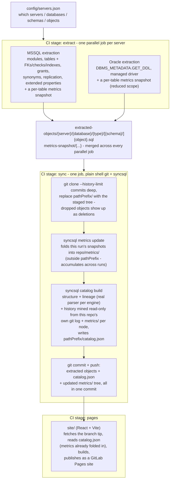

# SyncSQL

Scheduled extraction of database objects (stored procedures, views,
functions, triggers, tables — with foreign keys, check constraints and
indexes attached — schemas, synonyms, linked servers / database links, and
best-effort replication topology) from a fleet of **MSSQL** and **Oracle**
servers into this repository — one file per object, one commit per run,
diffable like any other source code — followed by a structure/lineage/
history analysis published as a browsable **React site on GitLab Pages**.
Volatile, daily-changing operational data (row counts, index
fragmentation/usage, the statistics the query optimizer actually uses) is
tracked separately as a graphable time series rather than bloating that
version history — see "Volatile metrics" below.

The extraction, lineage inference, and catalog building is a cross-platform
**.NET 10 CLI** (`cli/`, published as the `syncsql` dotnet global tool - see
[`cli/docs/cli.md`](cli/docs/cli.md) for the full command reference). It
runs anywhere .NET 10 runs - Linux, macOS, or Windows - both in CI and
locally, with no native Oracle client install required
(`Oracle.ManagedDataAccess.Core` is a fully managed ADO.NET driver) and no
separate bootstrap step: every dependency, including the real parsers behind
lineage inference for both engines, is a normal NuGet package reference.
The CLI itself never touches git - it only reads and writes local files;
cloning, committing, and pushing are the CI pipeline's own job (see
"CI/CD pipeline" below).

## How it works



Extraction fans out across the fleet as independent parallel jobs (safe -
each always writes under its own server's path first, so different servers
never collide); a single job downloads the merged result and does the one
publish, so there's still exactly one commit and one push per run - see
[`.gitlab/README.md`](.gitlab/README.md) for the tradeoff that split buys
and the one-line fallback to a single sequential job for a small fleet.

Every extracted `.sql` file gets a small static header (server / database /
type / object name / engine) and nothing else — no timestamps — so
re-running the pipeline with no underlying database changes produces **zero
diff**.

## The syncsql CLI

`cli/` is a Clean/Onion-architecture .NET 10 solution: `SyncSql.Core` holds
domain records and abstractions with zero infrastructure dependencies;
`SyncSql.Extraction.MsSql`/`.Oracle`, `SyncSql.Lineage.MsSql`/`.Oracle`, and
`SyncSql.Catalog` each implement one of those abstractions; `SyncSql.Cli`
is the sole composition root, wiring everything via dependency injection
and exposing the commands below. Every project outside `SyncSql.Cli`
depends only inward on `SyncSql.Core`. There is no git-publish project or
abstraction anywhere in this solution - `syncsql` only reads and writes
local files (`SyncSql.Catalog`'s history mining is a read-only `git log`/
`git show`, never a write).

```
syncsql validate-config --config <path>
syncsql sync --config <path> [--staging-root] [--metrics-snapshot-root]
             [--server-include/--server-exclude]
syncsql catalog build --objects-root <path> --output <path>
                       [--repo-root] [--path-prefix] [--history-limit]
                       [--max-versions-per-object] [--max-history-content-calls]
                       [--max-co-change-commit-size] [--metrics-root]
syncsql metrics update --snapshot-root <path> --history-root <path>
                        [--history-limit]
syncsql lint --path <file-or-dir>... [--fail-on warning|error]
```

`sync` extracts (purely local - no git of any kind); `catalog build` and
`metrics update` are the other two pure, composable steps (rebuild the
catalog, fold metrics history) - handy for local preview or rebuilding
`catalog.json` against a different history window without re-extracting.
`lint` is a fourth, database-free step: it parses T-SQL script(s) with the
same real `ScriptDom` parser `catalog build` uses for lineage and reports
syntax errors plus a few style/best-practice findings (`SELECT *`, `NOLOCK`
hints, cursor usage) - see [`cli/docs/cli.md`](cli/docs/cli.md) for the
full rule list.
Publishing results to git is entirely the calling pipeline's job, done as
plain shell (see [`.gitlab/README.md`](.gitlab/README.md)) - `syncsql`
itself never clones, commits, or pushes. Install it as a
[dotnet global tool](https://learn.microsoft.com/dotnet/core/tools/global-tools)
from the project's Nexus feed, or run it straight from source with
`dotnet run --project cli/src/SyncSql.Cli --`. Full option reference,
install instructions, and exit codes: [`cli/docs/cli.md`](cli/docs/cli.md).

## Configuration

Copy `config/servers.example.json` to `config/servers.json` and edit it.
Nothing in that file is secret: it lists server hostnames and the regex
filters that decide what gets extracted. See the field descriptions below
for the full schema; in short:

- `git`: where extracted objects get pushed. Read and acted on directly by
  the `sync-database-objects` job (via `jq`) - see
  [`.gitlab/README.md`](.gitlab/README.md) - `syncsql`
  itself never touches this block. Left blank (the default), objects are
  pushed back into **this same project** using the predefined
  `CI_SERVER_*` variables — see [`.gitlab/README.md`](.gitlab/README.md)'s
  "Required CI/CD variables" for the token that requires. Set it to a
  full URL to push into a different project instead.
- `defaults` / per-server overrides: `databases`, `schemas`,
  `objectNames` include/exclude regex lists, and an `objectTypes` list
  (`Schemas`, `Tables`, `Views`, `StoredProcedures`, `Functions`,
  `Triggers`, `Synonyms`, `LinkedServers`, `Replication` for MSSQL;
  `Schemas`, `Tables`, `Views`, `Procedures`, `Functions`, `Packages`,
  `PackageBodies`, `Triggers`, `Synonyms`, `DatabaseLinks` for Oracle).
  A server that specifies a key fully replaces the default for that key.
- `serverSelection`: regex filter over which of the listed servers
  actually run in a given pipeline execution (can also be overridden per
  run with `--server-include` / `--server-exclude`).

Filtering is regex-based and works at every level mentioned in the
config: server, database, schema, and individual object name.

Credentials are **never** stored in the config. Each server entry has a
`credentialsVariablePrefix`; the pipeline reads
`<prefix>_DB_USER` / `<prefix>_DB_PASSWORD` from the environment.

## CI/CD pipeline

The pipeline (`.gitlab-ci.yml` and the modules it includes under
`.gitlab/ci/`) is what actually runs the flow described above: validating
`config/servers.json`, running the extraction jobs, publishing results to
git, and building/deploying the catalog site. Required CI/CD variables,
trigger rules, and a job-by-job explanation - including the `syncsql`
tool's own build/publish pipeline - are documented in
**[`.gitlab/README.md`](.gitlab/README.md)**; set the required variables
there before running it, and see it for how to fall back to a single
sequential extraction job for a small fleet.

## The catalog / lineage site

`site/` is a React + TypeScript + Vite app (source checked into this repo,
built fresh by the `pages` job on every scheduled run), styled as a dense
data-terminal with a light/dark toggle (top right; light is the default -
see "Theme" below):

- **Overview** — object counts, the 10 most recently changed objects, the
  most-referenced tables (direct incoming edges and indirect/transitive
  reachability, capped to one hop across a linked-server boundary), a
  change-frequency heatmap, and objects that tend to change together in
  the same commit.
- **Explorer** — a sortable, filterable table listing every object; it's the
  primary way to browse the catalog (there is no separate tree sidebar - see
  "Explorer replaces the sidebar" below).
- **Object detail** — qualified name, `sys.extended_properties` descriptions
  (object + column level, MSSQL only), the full structural column list with
  data types (Tables/Views), the DDL, structured panels for any Foreign Keys
  / Check Constraints / Indexes sections, a **Metrics** panel of volume/
  index/optimizer-statistics trend graphs for tables (see "Volatile
  metrics" below), an **Access** panel (see "Grant mapping" below), a
  change-history list with a point-in-time viewer, and "depends on" / "used
  by" lineage lists annotated with column tags (expandable past the first
  few) with an embedded neighborhood graph.
- **Lineage** (`/#/lineage`) — a full graph explorer rendered with
  `@xyflow/react` + `dagre` auto-layout, with two modes (tabs):
  - **Browse** — the object filter bar drives which objects are shown.
    Clicking a node drills the graph into that object's own neighborhood in
    place (breadcrumb trail, Back button, adjustable 1/2/3-hop radius)
    rather than leaving the page; double-click opens that object's full
    detail page. An object page's "Open in full lineage explorer" link
    lands here with an actual filter token seeded for that object, so
    clearing the drill-down focus narrows back to it instead of dumping out
    to the whole catalog.
  - **Access** — search by grantee (user, role or group) to see every
    object they have a GRANT or DENY permission on, down to the column when
    scoped that way (see "Grant mapping" below); matches are listed in a
    table and rendered in the same graph, so you can drill from "what can
    this principal touch" straight into how those objects relate.

  Edges carrying a known column-level reference (see "Column dependency
  tracking" below) are highlighted, labeled with up to 3 referenced column
  names, and clickable — click one to open a detail panel with the full
  column list for that edge.
- **History** — a global commit timeline of everything the pipeline has
  changed, expandable per commit.

All of Explorer/Lineage's filter bar share one GitLab-style filter bar: type
to get attribute suggestions (server, database, schema, type, name,
description), pick an operator (is / is not / contains / is in / is not
in), then pick from suggested values pulled from the catalog. Suggestion
lookups are capped and debounced, and committed filters (not keystrokes)
are what actually re-filter the object list, so it stays responsive on
large catalogs.

**Lineage inference uses a real parser for each engine, not text
matching.** `syncsql` tags every extracted object with the engine that
produced it (a `-- Engine:   mssql`/`oracle` header line written into every
extracted `.sql` file, alongside `-- Server:`/`-- Database:`/etc.) and
dispatches to that engine's analyzer when building the catalog:

- **MSSQL** objects are parsed with `Microsoft.SqlServer.TransactSql.ScriptDom`
  (a direct NuGet dependency of `SyncSql.Lineage.MsSql`, real T-SQL AST, not
  text matching): table/view references, schema-qualified function calls,
  `EXEC`/`EXECUTE` targets, `FOREIGN KEY ... REFERENCES` targets, and
  column references bound to their actual FROM-clause alias are all read
  straight off the parse tree.
- **Oracle** objects are parsed with a real ANTLR4 PL/SQL grammar
  (`SyncSql.Lineage.Oracle` vendors the `.g4` grammar files from
  [antlr/grammars-v4](https://github.com/antlr/grammars-v4); the
  lexer/parser is generated at build time, nothing generated is committed)
  - the same real-AST treatment as MSSQL: table/view references, package/
    procedure/function calls (including schema-qualified and `call_statement`
    invocations), `FOREIGN KEY` references, and alias-bound column
    references are all read off the parse tree.

Neither engine matches identifiers inside string literals or comments
(including Oracle's `q'...'` alternative quoting), misreads `SELECT *`/
computed columns as references, or guesses an alias's target from nearby
text rather than the parser's own binding. Any node missing an `Engine` tag
(an extraction from before that header field existed) is simply skipped for
lineage inference rather than guessed at.

None of this is a certified lineage report - it will still miss dynamic SQL
and anything built at runtime, and a traversal that crosses a linked-server/
DB-link boundary (in the "most referenced indirectly" analytics) still stops
one hop past that boundary rather than fanning out across a remote server's
own dependency graph. The site says as much on its overview page.

### Explorer replaces the sidebar

Earlier versions of the site had an always-open (later toggleable) tree
sidebar (Server → Database → Schema → Type → Object) alongside Explorer.
It has been removed: Explorer's filter bar plus sortable columns cover the
same browsing need with less UI, and every other page (Lineage, Overview,
History) links directly to object detail pages rather than requiring the
tree.

### Theme

A light/dark toggle lives in the top right of every page (`lib/ThemeContext.tsx`),
persisted to `localStorage`. Light is the default, styled around the
SyncSQL brand red. Dark uses **"Midnight"** — a dark, purple-tinted palette
in the style of a well-known VS Code dark theme (background/foreground/
comment/accent colors all drawn from it, pink standing in for brand red as
the accent). DDL/code blocks are the one deliberate exception — always
rendered in the Midnight palette (`components/midnight-hljs.css`, a
hand-mapped `highlight.js` theme) regardless of which site theme is active,
so SQL stays legible with one consistent look. The Lineage graph
(`@xyflow/react`) follows the site theme too, defaulting to light along
with everything else.

### Grant mapping

The catalog builder parses a per-object "Grants" section (attached by the
extraction backend, best-effort - see "Known limitations" below) into a
structured `grants` list on each catalog node: grantee, grantee type (MSSQL
only - `SQL_USER`, `DATABASE_ROLE`, `WINDOWS_GROUP`, ...), permission
(`SELECT`, `EXECUTE`, ...), state (`GRANT`/`DENY` - MSSQL only, Oracle has
no DENY concept), and the column when the grant was scoped to one rather
than the whole object.

- MSSQL: `sys.database_permissions` (object/column-level, class =
  `OBJECT_OR_COLUMN`) joined to `sys.database_principals` for the grantee
  and its type.
- Oracle: `ALL_TAB_PRIVS` (object-level) and `ALL_COL_PRIVS`
  (column-level) for every object owned by each extracted schema.

Every object's detail page has an **Access** panel (below the DDL and its
appended sections, above Change history) listing its own grants; the
Lineage page's **Access** tab flips the query around - search by grantee to
see every object (and, when scoped, column) that principal can touch, both
in a table and in the graph. Both degrade to "no grants" rather than
failing extraction when the underlying permissions view isn't accessible to
the connecting account.

### Volatile metrics

Row counts, index fragmentation/usage, and the statistics the query
optimizer actually consults for cardinality estimation all change on every
run by nature - embedding them in an object's own extracted `.sql` file
would turn "zero diff when nothing changed" into "diff every single run"
for every table, which defeats the point of versioning the objects at all.
So this data is tracked as its own accumulating time series instead,
entirely separate from the object's version history:

- Each extraction backend captures one metrics snapshot per table per run,
  staged separately and never mixed into the object's own `.sql` file:
  - **Volume**: row count and reserved/data/index size in KB (MSSQL:
    `sys.dm_db_partition_stats` + `sys.allocation_units`, the same
    aggregation `sp_spaceused` uses; Oracle: `ALL_TAB_STATISTICS`, size
    estimated as `BLOCKS * 8KB` rather than read from `DBA_SEGMENTS`, to
    avoid needing elevated privileges).
  - **Index metrics**: MSSQL gets fragmentation % and page count
    (`sys.dm_db_index_physical_stats`, cheap `'LIMITED'` mode) plus
    always-on usage counters - seeks/scans/lookups/updates
    (`sys.dm_db_index_usage_stats`, which itself resets on service
    restart, so this is inherently a point-in-time reading, not a durable
    fact). Oracle gets row count/distinct keys/leaf blocks
    (`ALL_IND_STATISTICS`) - it has no equivalent of MSSQL's always-on
    per-index usage counters without enabling the Diagnostics Pack, so
    seeks/scans/lookups/updates are simply absent for Oracle indexes.
  - **Optimizer statistics** - the actual histogram/density summary the
    query optimizer uses, not the `CREATE STATISTICS` object definition:
    rows, rows sampled, histogram step count, modification counter (rows
    changed since the last refresh) and last-updated time (MSSQL:
    `sys.dm_db_stats_properties`; Oracle has no separate named
    stats-object abstraction - the table stats *are* what the optimizer
    uses, so this is a single synthetic entry per table, with the
    modification counter summed from `ALL_TAB_MODIFICATIONS` when
    available).
- `syncsql metrics update` runs inside the same git checkout the catalog
  builder uses, but writes to `<repo>/metrics/` - a tree kept entirely
  outside `config.git.pathPrefix`, so the CI pipeline's
  wipe-and-replace of the object tree never touches it. Each run appends
  this run's snapshot to the existing history array per table and trims it
  to `--history-limit` (default 90, override via the `METRICS_HISTORY_LIMIT`
  CI variable / `sync --metrics-history-limit`) - so the object's own file
  stays diff-free while `metrics/` accumulates real history.
- `syncsql catalog build` reads that same `metrics/` tree and attaches it
  as `node.metrics` in `catalog.json`, so the site never needs a second
  fetch.

Every object's detail page shows this as a **Metrics** panel (row count,
size, index fragmentation/usage, and optimizer-statistics graphs, plus the
latest snapshot's statistics table) whenever a table has history to show;
it's simply absent for objects with none. Every one of these queries
degrades independently (with a warning) rather than failing extraction, the
same posture as every other optional extraction step in this project.

Tables dropped from the source database keep their existing metrics history
file rather than being cleaned up - a minor storage cost, not a correctness
issue.

### Column dependency tracking

Tables and views get a full structural column list (name + data type),
independent of whether a column happens to have an
`sys.extended_properties`/documentation entry - `sys.columns` (MSSQL) /
`ALL_TAB_COLUMNS` (Oracle). The catalog builder then checks each inferred
edge's source object for `alias.column` references against the target's
column list, and records which of the target's columns are actually
referenced on that edge - using each engine's own analyzer for both the
edge and the alias binding, so `alias.column` resolves to the exact table
that alias was declared against on the parse tree, not a guess from nearby
text. This still isn't a certified column-level lineage report - it will
miss dynamic SQL, `SELECT *`, and computed/aliased column expressions.

This shows up as column tags next to each entry in an object's "depends
on"/"used by" lists, and as highlighted, labeled edges in the Lineage
graph.

### Orphaned reference detection

Cheap to compute once lineage inference has run: every reference that
resolves nowhere in the current catalog's scope (same server+database, or
bare on the same server) is collected as an **orphaned reference** rather
than just silently producing no edge. In practice this is almost always a
real bug worth flagging - the referenced table/view/procedure was renamed
or dropped and the object still calling it was never updated - though it
can occasionally be a false positive: dynamic SQL, a genuinely external
object (a linked-server target, a system object) that was never in scope
to begin with, or a name built at runtime.

A reference that's merely *ambiguous* - more than one same-named object in
scope - is deliberately **not** flagged this way; that's a different
situation (the target clearly exists, it just can't be resolved uniquely
from a bare name) and conflating the two would bury real orphaned
references in noise from otherwise-benign naming collisions.

`syncsql catalog build` writes these to `catalog.json`'s
`orphanedReferences` array (`from`/`schema`/`name`) and logs a summary
count as a warning.

### History, heatmap and point-in-time

A static Pages site can't run live `git` queries, so the catalog builder
mines history *during the sync CI stage* instead, right before committing:
`sync-database-objects`'s shell script clones the target repo deeply
enough (`--depth`/`--history-limit` commits, default 250 — override via
the `HISTORY_LIMIT` CI variable) for `syncsql catalog build` to mine it
(`--repo-root`, read-only - `git log`/`git show`, no writes), and the
resulting `catalog.json` is written straight into that same checkout and
committed alongside the objects it describes - so it's versioned in git
history too, not just a CI artifact that disappears after the job
expires. Mining history produces:

- a global commit timeline (the History page and Overview's "latest
  changes"),
- per-object change counts / last-changed dates (Explorer columns, the
  heatmap),
- co-change pairs — objects that keep showing up in the same commit,
- and a bounded per-object version history with DDL content fetched via
  `git show`, powering the "view this object as of a past commit" selector
  on the object detail page.

This is **not** a full whole-database time machine — reconstructing the
entire catalog (including lineage) at every historical commit would mean
re-running the whole analysis per commit, which doesn't fit a scheduled
CI job. What you get is real historical DDL per object within the mined
commit window, plus a commit-level view of what changed together, which
covers the practical "what changed and when" questions without that cost.
Running `syncsql catalog build` without `--repo-root` (no repo to mine)
simply omits all of this — empty history, zero change counts — rather
than failing.

To work on the site locally:

```sh
cd site
npm install
npm run dev
```

`site/public/data/catalog.json` ships a small demo fixture so `npm run dev`
has something to render before any pipeline has actually run; replace it
with a real one (see below) to preview actual data.

## Running the extraction locally

```bash
export SQLPROD01_DB_USER='...'
export SQLPROD01_DB_PASSWORD='...'
syncsql sync --config ./config/servers.json --staging-root ./staging
```

`sync` is purely local - it just leaves the extracted files under
`--staging-root` (printed in the log if you don't pass one) and the
metrics snapshots under `--metrics-snapshot-root`. To build a
`catalog.json` for local preview, feed the object staging directory into:

```bash
syncsql catalog build \
  --objects-root <staging-dir> \
  --output ./site/public/data/catalog.json
```

(add `--repo-root`/`--path-prefix` pointed at a real git checkout of your
target repo to include history; add `--metrics-root <metrics-staging-dir>`
to include that one run's metrics snapshot - real trend graphs need
several runs' worth of history accumulated in a real `metrics/` tree, so a
single local run only shows a single data point per chart), then
`npm run dev` inside `site/`. See [`cli/docs/cli.md`](cli/docs/cli.md) for
every option and install instructions (the `syncsql` global tool, or
`dotnet run --project cli/src/SyncSql.Cli --` straight from source).

## Known limitations (v2)

- MSSQL table DDL (columns, identity, defaults, primary key) is
  reconstructed from catalog views since SQL Server doesn't store table
  definitions as text the way it does for procedures/views. Foreign keys,
  check constraints and non-PK indexes are captured too, but as separate
  appended sections rather than folded into the `CREATE TABLE` statement
  itself. (Statistics *objects* - `CREATE STATISTICS` definitions - are no
  longer extracted as DDL at all; see "Volatile metrics" above for what
  replaced them and why.)
- MSSQL server-scoped DDL triggers are not extracted, only database-level
  DML/DDL triggers (covered by `sys.sql_modules`).
- `sys.extended_properties` extraction (MSSQL) covers object- and
  column-level properties (class 1) only — database- and schema-level
  properties are not collected.
- MSSQL replication extraction covers publications and their articles
  only (best-effort, requires `dbo.syspublications`/`dbo.sysarticles` to
  exist and be readable) — subscriber enumeration is intentionally left
  out since subscription table shapes vary too much across SQL Server
  versions/topologies to guess at reliably.
- Oracle `DatabaseLinks` extraction requires privileges on `SYS.LINK$`
  (or equivalent); without them, that object type is skipped with a
  warning rather than failing the whole run.
- Linked server / database link passwords are never extracted (not
  readable from the catalog) — the generated script has a placeholder
  that must be filled in manually if ever used to recreate the link.
- Lineage inference (both engines - see "Lineage inference uses a real
  parser" above) will still miss dynamic SQL and anything built at
  runtime, including four-part cross-linked-server names constructed at
  runtime rather than written literally.
- Grant extraction (MSSQL `sys.database_permissions`, Oracle
  `ALL_TAB_PRIVS`/`ALL_COL_PRIVS`) only covers object/column-level grants
  on the extracted objects themselves — server/database-level permissions,
  role membership, and (Oracle) whether a grantee is itself a user or a
  role are out of scope. See "Grant mapping" above.
- History/heatmap/point-in-time only cover the mined commit window
  (`HISTORY_LIMIT`, default 250 commits) and only reconstruct individual
  objects' DDL, not a full historical catalog snapshot — see "History,
  heatmap and point-in-time" above.
- Volatile metrics only cover **Tables** (not Views, which have no physical
  storage/indexes of their own to measure) and only retain the last
  `METRICS_HISTORY_LIMIT` snapshots (default 90) per table. Oracle's
  version is reduced-scope versus MSSQL's - no index fragmentation or
  usage counters (needs the Diagnostics Pack), and size is an 8KB-block
  estimate rather than exact segment bytes. A table dropped from the
  source database keeps its existing metrics history rather than being
  cleaned up. See "Volatile metrics" above.

Every optional/best-effort extraction step (extended properties, grants,
full column lists, volatile metrics, FKs, checks, indexes, replication)
degrades independently: a failure on one is logged as a warning and the
rest of that database's extraction proceeds normally.
