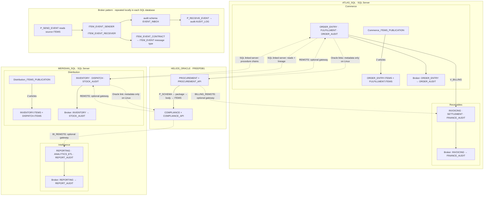

# Heterogeneous lineage benchmark

A first-party scenario with an independent, engine-neutral expected catalog. It
tests extraction, object identities, explicit grants, linked-hop attribution,
package implementation dependencies, cycles, replication publications and Service
Broker messaging.

| Server | Database/service | Schemas |
|---|---|---|
| ATLAS_SQL | Commerce | ORDER_ENTRY, FULFILLMENT, ORDER_AUDIT |
| ATLAS_SQL | Receivables | INVOICING, SETTLEMENT, FINANCE_AUDIT |
| MERIDIAN_SQL | Distribution | INVENTORY, DISPATCH, STOCK_AUDIT |
| MERIDIAN_SQL | Intelligence | REPORTING, ANALYTICS_ETL, REPORT_AUDIT |
| HELIOS_ORACLE | FREEPDB1 | PROCUREMENT, COMPLIANCE |

Every database and schema name is distinct. Each of the 14 schemas has four
tables, two views, two procedures, a function and a trigger. Additional objects
exercise remote paths. Oracle also has PROCUREMENT_API and COMPLIANCE_API, each
with ten callable functions and a separate specification/body.

There are **208 catalog objects**, **192 semantic dependencies**, and **48 workload
users**: three per schema (42), plus three for each Oracle package (6). Schema
owners and engine administrators are infrastructure accounts outside that total.
Packages are not schemas and cannot own tables or triggers.

READ users can select ITEMS and a view; WRITE users can insert rows and update
AMOUNT, with no SELECT grant; EXEC users can execute the local procedures. SQL
Server additionally DENYs SELECT on ITEMS to EXEC users. Package users can execute
their package; its READ user additionally selects ITEMS, and its WRITE user can
update AMOUNT. Oracle grants EXECUTE on a whole package, not individual members.
The relevant EXEC users also receive the remote procedures, giving user-based
lineage traversal entry points into every chain and cycle.

Objects deliberately reuse names such as ITEMS and P_READ across different,
uniquely named schemas. The two Oracle owners both declare REMOTE, pointing to
different SQL Server instances. This catches resolution that loses scope.

## Bigger picture

Solid arrows below show declared dependencies and local Broker message flow.
Dashed arrows cross a server boundary; their labels describe execution support.
Publication arrows identify article sources, not subscriber delivery. Database
links remain owner-scoped even where this overview groups their destinations.



## Replication and Service Broker

Two real transactional publications each publish two existing `ITEMS` tables:
`Commerce_ITEMS_PUBLICATION` on ATLAS_SQL and `Distribution_ITEMS_PUBLICATION` on
MERIDIAN_SQL. Both instances have a local `lineage_distribution` infrastructure
database, excluded from catalog extraction. The benchmark recreates publications
on reruns and compares all four article-to-source dependencies. Article names
include their schema to distinguish tables with the same name.

This scenario does not configure subscriptions or assert replicated row delivery.
SQL Server Agent stays disabled so replication jobs do not run; SQL Server may
create infrastructure jobs when publications are registered. Extracted
publication SQL is an informational snapshot with article source declarations,
not a complete replication deployment script.

All four SQL databases enable Service Broker and contain a message type, a
contract, two queues, two services and two procedures. Names deliberately repeat
across databases. `P_SEND_EVENT` reads the source schema's `ITEMS`, builds an XML
message and sends it to the audit service. `P_RECEIVE_EVENT` receives the message
and inserts its values into the audit schema's `AUDIT_LOG`. Queue activation is
not configured; the benchmark invokes the receiver explicitly.

| Database | Sender schema | Receiver schema |
|---|---|---|
| Commerce | ORDER_ENTRY | ORDER_AUDIT |
| Receivables | INVOICING | FINANCE_AUDIT |
| Distribution | INVENTORY | STOCK_AUDIT |
| Intelligence | REPORTING | REPORT_AUDIT |

The existing EXEC users receive execution rights on their respective procedures,
which run as owner. The live check sends as the source EXEC user, verifies that
the READ user cannot execute the sender, receives as the audit EXEC user, checks
the delivered payload, completes the EndDialog handshake and removes probe rows.
Messaging stays within each database; no cross-instance Broker transport is
claimed. `benchmark.json` records Broker execution, publication metadata and the
replication delivery boundary separately.

References: [SQL Server replication distribution setup](https://learn.microsoft.com/en-us/sql/relational-databases/system-stored-procedures/sp-adddistributiondb-transact-sql),
[Service Broker objects](https://learn.microsoft.com/en-us/sql/database-engine/service-broker/creating-service-broker-objects).

## Run

Requires Docker Compose v2, an x86-64 Linux Docker engine with about 8 GB of RAM,
and the .NET SDK pinned in the repository. The first run downloads Oracle Free.

```powershell
./samples/scripts/run-benchmark.ps1 -Scenario heterogeneous-lineage
# Or directly:
./samples/scenarios/heterogeneous-lineage/run.ps1
# Database-free contract tests:
./samples/scenarios/heterogeneous-lineage/run.ps1 -Offline
# Execute Oracle outbound queries through dg4msql (requires gateway media/image):
./samples/scenarios/heterogeneous-lineage/run.ps1 -Gateway
# Stop containers, retaining volumes:
./samples/scenarios/heterogeneous-lineage/run.ps1 -Down
```

```bash
bash samples/scripts/run-benchmark.sh --scenario heterogeneous-lineage
bash samples/scenarios/heterogeneous-lineage/run.sh --offline
bash samples/scenarios/heterogeneous-lineage/run.sh --down
```

Ports are bound to loopback: 14431, 14432 and 15231. Each live run **recreates the
four scenario databases and the Oracle workload schemas/users** on these isolated
containers. The provisioner verifies the configured Docker hostname before
resetting anything. Do not point this scenario at an existing database.

The runners copy .env.example to a git-ignored .env and publish the CLI once.
They then opt into the live test with SYNCSQL_HETEROGENEOUS=1. Ordinary solution
tests always run the offline contract and skip only the Docker test.

## Contract and test design

- [expected-catalog.json](expected-catalog.json) contains identities, columns,
  explicit privileges, attributed dependencies and sixteen named paths. It contains
  no SQL or parser output and is never updated from a benchmark run.
- [objects.json](objects.json) contains independently authored SQL and metadata
  for the offline catalog test. The provisioner executes the SQL and GRANT/DENY
  statements against the real engines. Live extraction does not read this file.
- [principals.json](principals.json) supplies the actual workload accounts.
- [servers.json](servers.json) configures the real CLI. Every server is explicitly
  extracted; linked-server auto-discovery is disabled to keep extraction finite
  and independent of remote credential forwarding.

The offline test initially failed on missing trigger targets, Oracle dynamic SQL,
owner-scoped links and package calls. It now exercises the production analyzers,
serializer and catalog builder. The live test provisions, logs in as every workload
user, checks allowed and forbidden table access, then invokes the real CLI:
validate-config, sync, metrics update and catalog build.

It also verifies the publication article metadata and four local Broker flows
before extraction. The offline contract checks Broker namespaces, source-table
references, queue/service/contract/message dependencies and their named paths.

Both compare exact object, column, grant and edge sets. Extra edges fail just like
missing ones. Paths follow attributed linked-server references, so a shared link
does not create a false path through another caller's target.

The named paths cover Oracle to SQL Server to another SQL Server to Oracle;
linked server to linked server; SQL Server to one Oracle schema to the other
schema/package; and both directions of the Oracle/SQL Server cycle. P_ONE and
P_TWO distinguish one remote destination from two and one Oracle schema/package
from both. Cycles describe dependencies; executing them recursively is not a
benchmark requirement.

Each live run writes a fresh .cache/runs/&lt;id&gt;/ directory with extracted SQL,
catalog.json, metrics, pipeline.log and benchmark.json (timings, pass/fail and
runtime capability status). lineage-index.json groups objects by type and lists
each user's explicitly granted roots and transitively referenced objects, with
cycle-safe traversal. This index describes dependencies, not remote effective
authorization. Credentials are deleted in a finally block. There is
no baseline-update switch for this scenario.

## Distributed-query execution boundary

This is a **live extraction and lineage benchmark**, not a claim that Linux SQL
Server executes Oracle OLE DB calls. Linux also rejects registration of the Oracle
provider. For the two Oracle-directed linked servers the Docker installer registers
MSOLEDBSQL transport placeholders with product **Oracle (lineage metadata only)**,
retaining the actual Oracle destination name. These are real sys.servers entries,
but they cannot execute Oracle queries. The offline DDL retains OraOLEDB.Oracle.
The live test asserts the labels and records this distinction in benchmark.json.
No extracted nodes are fabricated or merged in from the expected catalog.

Oracle database links are real declarations. Remote calls use literal dynamic SQL
so modules can be installed before gateway connectivity is enabled. The optional
[dg4msql gateway overlay](gateway/README.md) configures all four SQL databases and
tests real remote reads, user permissions and an Oracle-to-SQL-to-SQL view path.

SQL Server on Linux supports linked servers to SQL Server but does not support
third-party OLE DB providers. Executing SQL Server-to-Oracle calls requires a
provider-capable SQL Server installation. Oracle-to-SQL Server calls require an
Oracle heterogeneous-services gateway; dg4msql is not included in Oracle Free's
stock container. The overlay installs and configures it from separately obtained
Oracle media, or uses an existing gateway image.

The report records Oracle outbound execution as passed, failed/not reached, or
not requested. SQL-to-Oracle execution remains explicitly unsupported. The
benchmark does not silently skip a missing catalog object, unresolved hop,
compilation error or permission mismatch.

References: [Microsoft Linux feature support](https://learn.microsoft.com/en-us/sql/linux/sql-server-linux-editions-and-components-2019),
[Oracle gateway configuration](https://docs.oracle.com/en/database/oracle/oracle-database/26/otgis/config-odbc-gateway.html).
